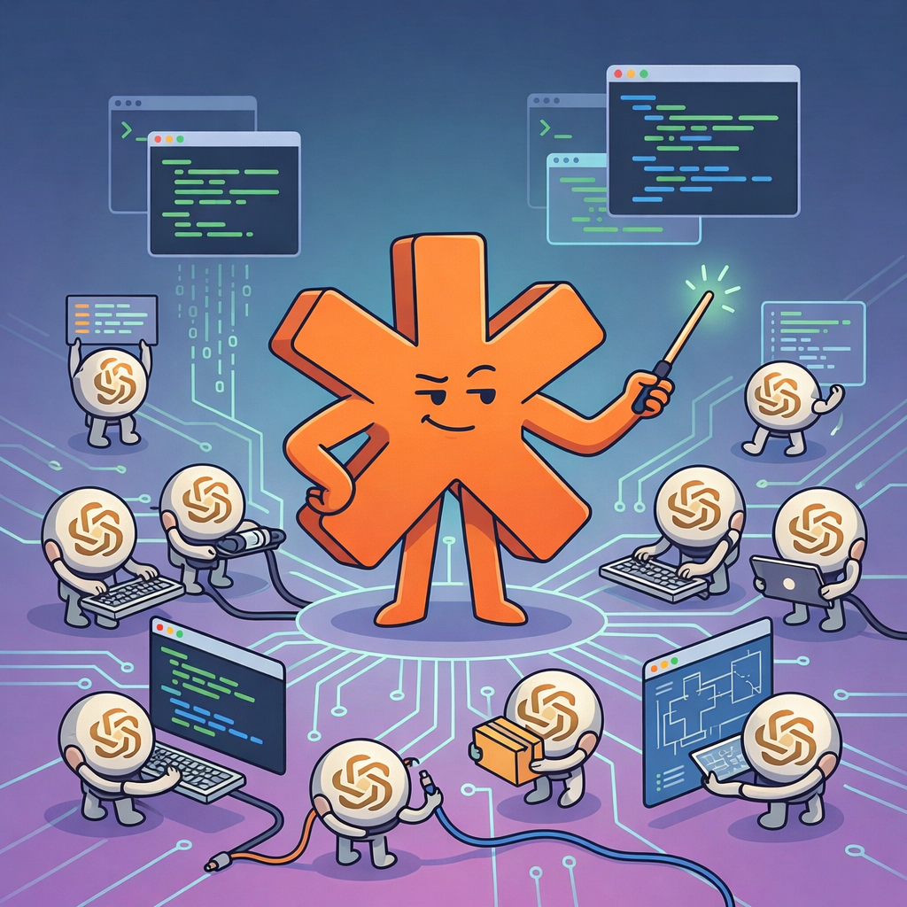

# CC Orchestrator

<p align="center">
  
</p>

**Turn Claude Code into a managed army of coding agents.**

CC Orchestrator is a CLI tool and Claude Code plugin that lets you (or Claude itself) spawn, monitor, message, and manage multiple Claude Code agents running in parallel via tmux sessions. Think of it as a process manager purpose-built for AI coding agents -- with bidirectional communication, a real-time web dashboard, live terminal streaming, and a structured pipeline for taking features from idea to tested code.

```
USER (you)
  |
  +-- Claude #1 (Orchestrator)
  |     +-- cc-agent: "Implement auth module"
  |     +-- cc-agent: "Write tests for auth"
  |     +-- cc-agent: "Security review"
  |
  +-- Claude #2 (Orchestrator)
        +-- cc-agent: "Refactor database layer"
        +-- cc-agent: "Update API docs"
```

Each Claude Code agent runs in its own tmux session with full terminal output logging, status tracking, and the ability to receive follow-up messages mid-task.

---

## Table of Contents

- [Quick Start](#quick-start)
- [Installation](#installation)
- [Core Concepts](#core-concepts)
- [CLI Reference](#cli-reference)
- [The Factory Pipeline](#the-factory-pipeline)
- [Autonomous Orchestrator](#autonomous-orchestrator)
- [Web Dashboard](#web-dashboard)
- [Claude Code Plugin](#claude-code-plugin)
- [Codebase Maps](#codebase-maps)
- [Multi-Agent Patterns](#multi-agent-patterns)
- [Configuration](#configuration)
- [Troubleshooting](#troubleshooting)
- [Architecture](#architecture)

---

## Quick Start

```bash
# 1. Install (handles tmux, bun, and claude CLI)
bash plugins/cc-orchestrator/scripts/install.sh

# 2. Verify everything works
cc-agent health

# 3. Spawn your first agent
cc-agent start "Review this codebase and summarize the architecture" --map -s read-only

# 4. Check on it
cc-agent jobs

# 5. See what it's doing
cc-agent capture <jobId>

# 6. Send it a follow-up message
cc-agent send <jobId> "Also check for security vulnerabilities"

# 7. The web dashboard auto-started at http://localhost:3131
#    Or launch manually:
cc-agent dashboard
```

---

## Installation

### As a Claude Code Plugin (Recommended)

**Step 1:** Add the marketplace:

```
/plugin marketplace add Narcis13/cc-master
```

**Step 2:** Install the plugin:

```
/plugin install cc-orchestrator
```

**Step 3:** Restart Claude Code (may be required for the skill to load)

**Step 4:** Install the CLI and dependencies:

```
/cc-orchestrator init
```

Or say "set up cc orchestrator" and Claude will walk you through it.

**Step 5:** Use it -- just ask Claude to do things. The skill activates automatically for coding tasks.

### Manual / CLI-Only Install

If you just want the `cc-agent` CLI without the Claude Code plugin:

```bash
# Prerequisites
brew install tmux                          # macOS (or apt/pacman/dnf for Linux)
npm install -g @anthropic-ai/claude-code   # Claude Code CLI

# Install
git clone https://github.com/Narcis13/cc-master.git ~/.cc-orchestrator
cd ~/.cc-orchestrator && bun install

# Add to PATH (add this line to ~/.bashrc or ~/.zshrc)
export PATH="$HOME/.cc-orchestrator/bin:$PATH"

# Verify
cc-agent health
```

Or use the automated installer that detects your platform, checks each dependency, installs what's missing, and configures your PATH:

```bash
bash <(curl -fsSL https://raw.githubusercontent.com/Narcis13/cc-master/main/plugins/cc-orchestrator/scripts/install.sh)
```

After installation, set your API key if not already configured:

```bash
export ANTHROPIC_API_KEY="your-key-here"
```

### Requirements

| Dependency | Purpose | Install |
|-----------|---------|---------|
| [tmux](https://github.com/tmux/tmux) | Terminal multiplexer -- agents run in tmux sessions | `brew install tmux` |
| [Bun](https://bun.sh) | JavaScript runtime -- runs the CLI | `curl -fsSL https://bun.sh/install \| bash` |
| [Claude Code CLI](https://docs.anthropic.com/en/docs/claude-code) | The coding agent being orchestrated | `npm install -g @anthropic-ai/claude-code` |
| Anthropic API key | API access for Claude Code agents | Set `ANTHROPIC_API_KEY` env var |

**Platform support:** macOS and Linux. Windows users should use WSL.

### Updating

After installation, update to the latest version with:

```
/cco-update
```

This pulls the latest code from GitHub into both the runtime (`~/.cc-orchestrator/`) and the plugin (`~/.claude/plugins/marketplaces/cc-orchestrator-marketplace/`), then reinstalls dependencies. Restart Claude Code after updating for skill changes to take effect.

If you installed cc-orchestrator before `/cco-update` was available (before v1.1), run this once to bootstrap the update skill:

```bash
git -C ~/.cc-orchestrator pull origin main
git -C ~/.claude/plugins/marketplaces/cc-orchestrator-marketplace pull origin main
```

Then restart Claude Code and use `/cco-update` going forward.

---

## Core Concepts

### Jobs

Every agent you spawn creates a **job**. A job tracks:

- A unique 8-character hex ID (e.g., `8abfab85`)
- Status lifecycle: `pending` -> `running` -> `completed` | `failed`
- A tmux session: `cc-agent-<jobId>`
- Prompt, model, reasoning effort, and sandbox mode
- Timestamps for creation, start, and completion
- Terminal output logged to `~/.cc-agent/jobs/<jobId>.log`
- Post-completion metadata: token usage, files modified, summary

### Bidirectional Communication

Unlike fire-and-forget scripts, cc-agent agents are **interactive**:

1. **Send messages** to a running agent to redirect, clarify, or add context
2. **Capture output** to see what the agent is currently doing
3. **Attach directly** to the tmux session for full interactive control
4. **Watch live** as output streams in real-time
5. **Communicate from the dashboard** via the web UI

### Sandbox Modes

| Mode | Access Level | Use Case |
|---|---|---|
| `read-only` | Can only read files, search, browse web | Research, code review, investigation |
| `workspace-write` (default) | Can read and modify files in workspace | Implementation, refactoring, test writing |
| `danger-full-access` | Unrestricted file system access | System-level changes (use with caution) |

### Reasoning Effort

| Level | Model | Use Case |
|---|---|---|
| `low` | Sonnet | Quick lookups, simple tasks |
| `medium` | Opus | Standard tasks |
| `high` | Opus | Complex implementation |
| `xhigh` (default) | Opus | Deep analysis, critical code |

---

## CLI Reference

### Starting Agents

```bash
cc-agent start "<prompt>" [options]
```

Creates a tmux session, launches Claude Code inside it, and sends your prompt. The agent begins working immediately and you get the job ID back instantly.

**Options:**

| Flag | Short | Values | Default | Description |
|---|---|---|---|---|
| `--reasoning` | `-r` | low, medium, high, xhigh | xhigh | Reasoning depth (low uses Sonnet, rest use Opus) |
| `--model` | `-m` | any model string | opus | Explicit model override |
| `--sandbox` | `-s` | read-only, workspace-write, danger-full-access | workspace-write | File access level |
| `--file` | `-f` | glob pattern | -- | Include files matching glob (repeatable) |
| `--dir` | `-d` | path | cwd | Working directory |
| `--map` | -- | flag | -- | Include `docs/CODEBASE_MAP.md` in prompt |
| `--parent-session` | -- | id | -- | Link to a parent session |
| `--completed` | -- | flag | -- | Mark killed job as completed instead of failed (`kill` only) |
| `--dry-run` | -- | flag | -- | Preview prompt without executing |

**Examples:**

```bash
# Research agent (read-only, can't modify files)
cc-agent start "Investigate the authentication flow for vulnerabilities" --map -s read-only

# Implementation agent (defaults are already optimized: opus, xhigh, workspace-write)
cc-agent start "Implement the user registration endpoint per the PRD" --map

# Agent with specific file context injected into prompt
cc-agent start "Refactor these modules to use dependency injection" \
  --map -f "src/auth/**/*.ts" -f "src/api/**/*.ts"

# Quick task with lighter model (Sonnet)
cc-agent start "Add a console.log to debug the login flow" -r low

# Preview what would be sent without actually running
cc-agent start "Audit the codebase" --map --dry-run
```

### Monitoring Agents

```bash
# Human-readable table of all jobs
cc-agent jobs

# Structured JSON with token counts, files modified, and summaries
cc-agent jobs --json

# Limit the number of jobs shown
cc-agent jobs --limit 5

# Show ALL jobs (override default limit of 20)
cc-agent jobs --all

# Check a specific job's detailed status
cc-agent status <jobId>

# See recent output (default: 50 lines)
cc-agent capture <jobId>

# See more output lines
cc-agent capture <jobId> 200

# Get the full session output
cc-agent output <jobId>

# Stream output live (like tail -f, Ctrl+C to stop)
cc-agent watch <jobId>

# Strip ANSI color/control codes from output
cc-agent capture <jobId> --strip-ansi
cc-agent output <jobId> --strip-ansi
```

**The `--json` flag** on `jobs` returns enriched data including token usage, files modified, and a summary of what the agent did:

```json
{
  "generated_at": "2026-02-09T10:30:00.000Z",
  "jobs": [
    {
      "id": "8abfab85",
      "status": "completed",
      "prompt": "Implement the auth refactor per PRD...",
      "model": "opus",
      "reasoning": "xhigh",
      "cwd": "/Users/you/project",
      "elapsed_ms": 184000,
      "created_at": "2026-02-09T10:00:00.000Z",
      "started_at": "2026-02-09T10:00:01.000Z",
      "completed_at": "2026-02-09T10:03:04.000Z",
      "tokens": {
        "input": 36581,
        "output": 4282,
        "context_window": 258400,
        "context_used_pct": 14.16
      },
      "files_modified": ["src/auth.ts", "src/types.ts"],
      "summary": "Implemented the authentication flow with JWT..."
    }
  ]
}
```

### Communicating with Agents

```bash
# Send a follow-up message to a running agent
cc-agent send <jobId> "Focus on the database layer first"

# Send context about a completed prerequisite
cc-agent send <jobId> "The dependency is installed. Run bun run typecheck now"

# Redirect an agent's focus
cc-agent send <jobId> "Skip the tests for now, prioritize the core logic"
```

**Important:** Always use `cc-agent send` rather than raw `tmux send-keys`. The send command handles escaping and timing (including a 0.3s delay before Enter for the TUI to process input).

For full interactive control, attach directly to the tmux session:

```bash
# Get the attach command
cc-agent attach <jobId>

# Or attach directly
tmux attach -t cc-agent-<jobId>
# Ctrl+B, D to detach without killing the session
```

### Controlling Agents

```bash
# Kill a running agent (last resort -- prefer sending a message to redirect)
cc-agent kill <jobId>

# Kill an agent that finished its work but is still in interactive mode
# Marks the job as completed instead of failed
cc-agent kill <jobId> --completed

# Delete a job record entirely (also kills the tmux session if running)
cc-agent delete <jobId>

# Clean up old completed/failed jobs (older than 7 days)
cc-agent clean

# List active tmux sessions
cc-agent sessions

# Health check
cc-agent health
```

### Dashboard

The dashboard **auto-starts in the background** whenever you start an agent with `cc-agent start`. No separate command needed -- just start an agent and open `http://localhost:3131`.

```bash
# Launches automatically with agents, or start manually:
cc-agent dashboard

# Use a custom port
cc-agent dashboard --port 8080

# Stop the running dashboard
cc-agent dashboard-stop
```

### Event Hooks

```bash
# Install Claude Code hooks for fine-grained event tracking
cc-agent setup-hooks

# Remove installed hooks
cc-agent remove-hooks
```

---

## The Factory Pipeline

CC Orchestrator follows a 7-stage pipeline for taking features from idea to tested code. When used as a Claude Code plugin, Claude automatically detects which stage you're in and acts accordingly.

```
USER'S REQUEST
     |
     v
1. IDEATION        (You + Claude -- clarify scope and approach)
     |
2. RESEARCH         (CC agents, read-only -- investigate the codebase)
     |
3. SYNTHESIS        (Claude -- review and combine agent findings)
     |
4. PRD              (You + Claude -- create a Product Requirements Document)
     |
5. IMPLEMENTATION   (CC agents, workspace-write -- build the feature)
     |
6. REVIEW           (CC agents, read-only -- security, quality, data integrity)
     |
7. TESTING          (CC agents, workspace-write -- write and run tests)
```

### Stage Detection

The pipeline stage is detected from context:

| Signal | Stage | Action |
|---|---|---|
| New feature request, vague problem | IDEATION | Discuss with user, clarify scope |
| "investigate", "research", "understand" | RESEARCH | Spawn read-only agents |
| Agent findings ready | SYNTHESIS | Review, filter, combine insights |
| "let's plan", "create PRD", synthesis done | PRD | Write PRD to `docs/prds/` |
| PRD exists, "implement", "build" | IMPLEMENTATION | Spawn workspace-write agents |
| Implementation done, "review" | REVIEW | Spawn review agents |
| "test", "verify", review passed | TESTING | Spawn test-writing agents |

### Stage 1: Ideation

Talk through the problem. Clarify scope, constraints, and approach before spawning any agents.

### Stage 2: Research

Spawn parallel read-only agents to investigate the codebase:

```bash
cc-agent start "Map the data flow from API to database for user creation" --map -s read-only
cc-agent start "Identify all places where user validation occurs" --map -s read-only
cc-agent start "Find security vulnerabilities in user input handling" --map -s read-only
```

### Stage 3: Synthesis

Review agent findings. Filter signal from noise:
- Agent suggests splitting a 9K token file -- probably good
- Agent suggests adding rate limiting -- good for quality
- Agent suggests types for code you didn't touch -- skip, over-engineering
- Agent contradicts itself -- investigate further

### Stage 4: PRD Creation

For significant changes, create a PRD in `docs/prds/`:

```markdown
# Feature Name

## Problem
What's broken or missing.

## Solution
High-level approach.

## Requirements
- Specific requirement 1
- Specific requirement 2

## Implementation Plan
### Phase 1: Core Logic
- [ ] Task 1
- [ ] Task 2

### Phase 2: Integration
- [ ] Task 3

## Files to Modify
- path/to/file.ts - what changes

## Testing
- [ ] Unit tests for X
- [ ] Integration test for Y

## Success Criteria
- How we know it's done
```

### Stage 5: Implementation

Spawn agents with PRD context:

```bash
cc-agent start "Implement Phase 1 of docs/prds/auth-refactor.md. Read the PRD first." \
  --map -f "docs/prds/auth-refactor.md"
```

For large PRDs, implement in phases with separate agents.

### Stage 6: Review

Spawn parallel review agents for different concerns:

```bash
# Security review
cc-agent start "Security review the recent changes. Check OWASP top 10, auth bypass, \
  data exposure, injection." --map -s read-only

# Error handling review
cc-agent start "Review error handling in changed files. Check for swallowed errors, \
  missing validation, raw errors exposed to clients." --map -s read-only

# Data integrity review
cc-agent start "Review for data integrity. Check existing data unaffected, queries \
  properly scoped, no accidental data deletion." --map -s read-only
```

### Stage 7: Testing

```bash
cc-agent start "Write comprehensive tests for the auth module changes" --map
cc-agent start "Run typecheck and all tests. Fix any failures." --map
```

### Quality Gates

| Stage | Gate |
|---|---|
| Research | Findings documented |
| Synthesis | Contradictions resolved, clear understanding |
| PRD | User reviewed and approved |
| Implementation | Typecheck passes, no new errors |
| Review | Security + quality checks pass |
| Testing | Tests written and passing |

---

## Autonomous Orchestrator

The autonomous orchestrator extends cc-agent with a self-managing Claude Code instance that processes task queues, responds to triggers, and maintains itself via a continuous pulse loop.

### Architecture

```
                    ┌─────────────────────────────────────┐
                    │         Pulse Loop (10s)             │
                    │                                     │
                    │  ┌──────────┐   ┌───────────────┐   │
                    │  │ Health   │   │ Evaluate      │   │
                    │  │ Check    │──>│ Triggers      │   │
                    │  └──────────┘   └───────┬───────┘   │
                    │       │                 │           │
                    │       v                 v           │
                    │  ┌──────────┐   ┌───────────────┐   │
                    │  │ Respawn  │   │ Fire Actions  │   │
                    │  │ if dead  │   │ (auto/confirm)│   │
                    │  └──────────┘   └───────────────┘   │
                    │       │                             │
                    │       v                             │
                    │  ┌──────────────────┐               │
                    │  │ Process Queue    │               │
                    │  │ (if idle)        │               │
                    │  └──────────────────┘               │
                    └─────────────────────────────────────┘
                                    │
                                    v
                    ┌───────────────────────────────────┐
                    │   Orchestrator (cc-agent-orch)     │
                    │   Dedicated Claude Code instance   │
                    └───────────────────────────────────┘
```

### Autonomy Levels

Triggers support two autonomy levels that control how actions are executed:

| Level | Behavior | Use Case |
|-------|----------|----------|
| `auto` | Action fires immediately when trigger condition is met | Routine tasks: status checks, context clears, queue processing |
| `confirm` | Action creates a pending approval visible in the dashboard; a human must approve or reject before execution | Destructive or high-impact actions: code changes, deployments, large prompts |

### Quick Start

```bash
# 1. Start the orchestrator instance
cc-agent orchestrator start

# 2. The pulse loop auto-starts with the dashboard
cc-agent pulse status

# 3. Activate a preset mode (installs trigger set)
cc-agent mode activate dev

# 4. Queue work for the orchestrator
cc-agent queue add "Refactor the auth module" --priority 5

# 5. Watch it work -- the pulse loop picks up the task when idle
cc-agent orchestrator status
```

### Orchestrator CLI

```bash
# Lifecycle
cc-agent orchestrator start [--model opus] [--reasoning xhigh]
cc-agent orchestrator stop
cc-agent orchestrator status
cc-agent orchestrator inject "message to send"

# Task queue
cc-agent queue add "prompt" [--priority N]
cc-agent queue list [--status pending]
cc-agent queue remove <id>

# Triggers
cc-agent trigger add <name> <type> <condition> <action> [--payload '...'] [--autonomy auto|confirm] [--cooldown 60]
cc-agent trigger list
cc-agent trigger toggle <id>
cc-agent trigger remove <id>

# Trigger types: cron, event, threshold
# Trigger actions: inject_prompt, clear_context, start_orchestrator, queue_task, notify

# Modes (preset trigger configurations)
cc-agent mode list
cc-agent mode activate <name>
cc-agent mode create <name> [--description "..."] [--from-current]
cc-agent mode delete <name>

# Pulse loop
cc-agent pulse start
cc-agent pulse stop
cc-agent pulse status
```

### Orchestrator API

The dashboard exposes REST endpoints for orchestrator management:

| Endpoint | Method | Description |
|----------|--------|-------------|
| `/api/orchestrator/start` | POST | Start orchestrator instance |
| `/api/orchestrator/stop` | POST | Stop orchestrator instance |
| `/api/orchestrator/status` | GET | Orchestrator status and state |
| `/api/orchestrator/inject` | POST | Inject message into orchestrator |
| `/api/queue/tasks` | GET/POST | List or add queue tasks |
| `/api/queue/tasks/:id` | PATCH/DELETE | Update or remove queue task |
| `/api/triggers` | GET/POST | List or create triggers |
| `/api/triggers/:id` | PATCH/DELETE | Update or remove trigger |
| `/api/triggers/:id/toggle` | POST | Toggle trigger enabled state |
| `/api/triggers/approvals` | GET | List pending approvals |
| `/api/triggers/approvals/:id/approve` | POST | Approve a pending action |
| `/api/triggers/approvals/:id/reject` | POST | Reject a pending action |
| `/api/triggers/activity` | GET | Orchestrator activity log |
| `/api/modes` | GET/POST | List or create modes |
| `/api/modes/:name/activate` | POST | Activate a mode |
| `/api/modes/:name` | DELETE | Delete a mode |
| `/api/pulse/start` | POST | Start pulse loop |
| `/api/pulse/stop` | POST | Stop pulse loop |
| `/api/pulse/status` | GET | Pulse status and summary |

### SSE Events

The orchestrator emits real-time events over the existing SSE stream (`/api/events`):

| Event Type | Payload | When |
|-----------|---------|------|
| `orchestrator_status_change` | `{ status }` | Orchestrator starts, stops, clears, or resumes |
| `orchestrator_context_warn` | `{ contextPct, clearState }` | Context usage exceeds threshold |
| `queue_update` | `{ task, operation }` | Queue task added, removed, or status changed |
| `trigger_fired` | `{ trigger_id, trigger_name, action }` | A trigger fires |
| `approval_required` | `{ approval }` | A `confirm` trigger creates pending approval |
| `pulse_tick` | `{ summary }` | Each 10s pulse tick completes |

---

## Web Dashboard

CC Orchestrator includes a full web dashboard for real-time monitoring and control of your agent army.

### Launching

The dashboard **auto-starts in the background** the first time you run `cc-agent start`. Subsequent agent starts detect the running dashboard and skip re-launching. You can also start/stop it manually:

```bash
cc-agent dashboard              # start manually (foreground, http://localhost:3131)
cc-agent dashboard --port 8080  # custom port
cc-agent dashboard-stop         # stop the running dashboard
```

The dashboard auto-builds a Preact frontend on startup (via Bun.build) and serves it alongside a REST/SSE/WebSocket API. No separate build step needed. A pidfile at `~/.cc-agent/dashboard.pid` tracks the running process.

### Dashboard Views

The dashboard has six views accessible via the top navigation bar:

#### Jobs (Home View)

The main view. Shows a grid of all agent jobs with:
- Status indicator (running/pending/completed/failed)
- Elapsed time
- Prompt preview
- Latest hook event activity

**Toolbar features:**
- **Filter** by status: All, Running, Pending, Completed, Failed
- **Sort** by: Recent, Status, Duration
- **Search** by job ID or prompt text

Click any job card to see its full detail view with live terminal output.

#### Timeline

Chronological event feed showing hook events across all agents: tool calls, file writes, errors, session starts/stops. Gives you a bird's-eye view of what all your agents are doing in real-time.

Requires hooks to be installed (`cc-agent setup-hooks`).

#### Alerts

Notification center for important events:
- Job completions and failures
- Agent errors
- Unread count badge in the nav bar

Mark individual alerts as read, dismiss them, or mark all as read.

#### Analytics

Historical metrics with charts showing:
- Jobs over time (started, completed, failed)
- Token usage (input and output)
- Average job duration
- Daily throughput and failure rates

Data is stored in a SQLite database (`~/.cc-agent/dashboard.db`) for persistence across dashboard restarts. Query ranges: 7 days, 30 days, or 90 days.

#### Split Terminal

Side-by-side terminal view for monitoring multiple running agents simultaneously. Select which agents to watch and see their live output in adjacent xterm.js terminals.

#### Pipeline

Gantt-chart-style timeline showing all jobs as horizontal bars. Visualizes:
- When each job started and ended (or is still running)
- Parallel execution overlap
- Relative duration of each job
- Time axis with tick marks

Click any bar to navigate to that job's detail view.

### Job Detail View

Clicking a job anywhere in the dashboard opens its detail view:
- Full metadata (ID, status, model, reasoning, sandbox, timestamps)
- **Live terminal output** via xterm.js with WebSocket streaming
- **Message input** to send follow-up messages to running agents
- **Kill button** for running agents
- Hook event activity feed for that specific job

The terminal panel renders the agent's actual terminal output with full color support, cursor positioning, and scrollback.

### Command Palette

Press `Ctrl+K` (or `Cmd+K`) to open the command palette -- a fuzzy-search launcher for:
- **Navigation**: Jump to any view (Jobs, Timeline, Alerts, Analytics, Split, Pipeline)
- **Jobs**: Jump to any job by ID or prompt text
- **Actions**: Start a new agent, kill running agents

Use arrow keys to navigate, Enter to select, Escape to close.

### Keyboard Shortcuts

| Key | Action |
|---|---|
| `Ctrl+K` / `Cmd+K` | Open command palette |
| `N` | Open new agent dialog |
| `/` | Focus search bar |
| `?` | Toggle keyboard shortcuts help |
| `Esc` | Close any dialog or palette |

### Starting Agents from the Dashboard

Click **"+ New Agent"** in the top bar (or press `N`) to open the new agent form. Set the prompt, model, reasoning effort, sandbox mode, and working directory, then launch.

### Real-Time Updates

The dashboard uses **Server-Sent Events (SSE)** to receive real-time updates from the backend:
- Job created, updated, completed, or failed
- Metrics updates
- Hook events from Claude Code

A green/red connection dot in the top bar shows SSE connection status.

Terminal output uses **WebSocket** connections for byte-level streaming from log files.

### REST API

The dashboard exposes a full REST API you can use programmatically:

| Endpoint | Method | Description |
|---|---|---|
| `GET /api/health` | GET | Health check |
| `GET /api/jobs` | GET | List all jobs with enriched data (tokens, files, summary) |
| `GET /api/jobs/:id` | GET | Single job details |
| `POST /api/actions/jobs` | POST | Start a new agent. Body: `{ prompt, model?, reasoning?, sandbox?, cwd? }` |
| `POST /api/actions/jobs/:id/send` | POST | Send message to running agent. Body: `{ message }` |
| `POST /api/actions/jobs/:id/kill` | POST | Kill a running agent. Body: `{ completed?: boolean }` |
| `GET /api/events` | SSE | Real-time event stream (snapshot on connect, then deltas) |
| `GET /api/metrics` | GET | Current aggregate metrics |
| `GET /api/metrics/history?range=7d` | GET | Historical daily metrics (7d, 30d, 90d) |
| `GET /api/metrics/jobs?limit=50` | GET | Historical job records from SQLite |
| `GET /api/hook-events` | GET | Recent Claude Code hook events |
| `WS /api/terminal/:jobId` | WebSocket | Live terminal output stream |

**WebSocket protocol** for terminal streaming:
- Server sends: `{ type: "initial", data: "..." }` on connect (full log contents)
- Server sends: `{ type: "delta", data: "..." }` for new output
- Server sends: `{ type: "completed", status: "completed"|"failed" }` when done
- Client sends: `{ type: "input", data: "..." }` to send messages to the agent

---

## Event Hooks

Install Claude Code hooks to get fine-grained event tracking across all your agents:

```bash
cc-agent setup-hooks
```

This modifies `~/.claude/settings.json` to add hooks for these Claude Code events:

| Event | Description |
|---|---|
| `PreToolUse` | Before any tool is used |
| `PostToolUse` | After Write, Edit, or Bash completes |
| `PostToolUseFailure` | When a tool call fails |
| `Stop` | When an agent stops |
| `Notification` | Agent notifications |
| `SessionStart` | When a session begins |
| `SessionEnd` | When a session ends |
| `PreCompact` | Before context compaction |

Events flow: Claude Code -> hook relay script -> `~/.cc-agent/events.jsonl` -> dashboard SSE stream + SQLite.

Events appear in the dashboard's Timeline view and in each job's detail view.

To remove hooks:

```bash
cc-agent remove-hooks
```

---

## Claude Code Plugin

When installed as a Claude Code plugin, CC Orchestrator transforms Claude into a **strategic orchestrator** that delegates all coding work to cc-agent. Claude handles the high-level thinking while agents handle the execution.

### How It Works

1. You talk to Claude normally about what you want to build
2. Claude automatically spawns cc-agent agents for any work involving code
3. Claude monitors agent progress, synthesizes findings, and reports back
4. You stay in the strategic loop while agents do the heavy lifting

### The Command Structure

```
USER - directs the mission
    |
    +-- CLAUDE #1 (Opus) --- General/Orchestrator
    |       +-- CC agent (coding specialist)
    |       +-- CC agent (coding specialist)
    |       +-- CC agent (coding specialist)
    |
    +-- CLAUDE #2 (Opus) --- General/Orchestrator
    |       +-- CC agent
    |       +-- CC agent
    |
    +-- CLAUDE #3 (Opus) --- General/Orchestrator
    |       +-- CC agent
    |
    +-- CLAUDE #4 (Opus) --- General/Orchestrator
            +-- CC agent
```

**You** set the vision and make strategic decisions. **Claude** commands its agent army on your behalf -- deciding which agents to spawn, what tasks to give them, coordinating parallel work, course-correcting as needed, and synthesizing results. **Agents** are hyper-focused coding specialists that read codebases deeply, implement carefully, and verify their work.

### Plugin Triggers

The plugin activates automatically on:
- Any task involving code writing, modification, or research
- Multi-step execution work
- Security audits, testing, file investigation
- Keywords: "spawn agent", "use agent", "delegate to agent", "cc agent", "init"

### What Claude Does vs. What Agents Do

**Claude (Orchestrator):**
- Discusses strategy with you
- Writes PRDs and specs
- Spawns and directs agents
- Synthesizes agent findings
- Makes decisions about approach
- Communicates progress

**Agents (Implementers):**
- Read and analyze codebases
- Write and modify code
- Run typechecks and tests
- Perform security reviews
- Handle all file-level work

---

## Codebase Maps

The `--map` flag is the most important flag you'll use. It injects `docs/CODEBASE_MAP.md` into every agent's prompt, giving them instant understanding of your entire codebase.

**Without a map:** Agents waste time exploring and guessing at structure.
**With a map:** Agents know exactly where things are and start working immediately.

### Generating a Map

Use the Cartographer plugin to scan your codebase and generate the map:

```
/plugin marketplace add Narcis13/cc-master
/plugin install cartographer
/cartographer
```

This produces `docs/CODEBASE_MAP.md` containing:
- System overview with architecture diagram
- Directory structure with token counts per file
- Module guide with exports, dependencies, and key behaviors
- Data flow diagrams
- Storage structure and conventions
- Navigation guide for common changes

### Using the Map

```bash
# Always include the map for agents working on your codebase
cc-agent start "Implement feature X" --map

# The map is searched in these locations (in order):
# 1. docs/CODEBASE_MAP.md
# 2. CODEBASE_MAP.md
# 3. docs/ARCHITECTURE.md
```

**Generate a codebase map before using cc-orchestrator on a new project.** It's the difference between agents that fumble around and agents that execute with precision.

---

## Multi-Agent Patterns

### Parallel Investigation

Spawn multiple research agents simultaneously to explore different aspects of a problem:

```bash
cc-agent start "Audit the auth flow for vulnerabilities" --map -s read-only
cc-agent start "Review API endpoint security" --map -s read-only
cc-agent start "Check data validation across all input handlers" --map -s read-only

# Monitor all at once
cc-agent jobs --json
```

### Sequential Implementation

Implement phases one at a time, verifying each before proceeding:

```bash
# Phase 1
cc-agent start "Implement Phase 1 of the PRD" --map -f "docs/prds/feature.md"
# ... wait for completion, review with: cc-agent jobs --json ...

# Phase 2 (after Phase 1 is verified)
cc-agent start "Implement Phase 2 of the PRD" --map -f "docs/prds/feature.md"
```

### Review Swarm

After implementation, spawn specialized reviewers in parallel:

```bash
cc-agent start "Security review: OWASP top 10, injection, auth bypass" --map -s read-only
cc-agent start "Error handling review: swallowed errors, missing validation" --map -s read-only
cc-agent start "Data integrity review: safe migrations, scoped queries" --map -s read-only
```

### Scaling with Multiple Claude Instances

The real power comes from running multiple Claude instances simultaneously, each managing its own agent army:

```
USER runs 4 Claude instances simultaneously
  |
  Claude #1: researching auth module       (3 agents)
  Claude #2: implementing feature A        (2 agents)
  Claude #3: reviewing recent changes      (4 agents)
  Claude #4: writing tests                 (2 agents)
```

N Claude instances x M agents each = N*M parallel workers on your codebase.

### Coordination via agents.log

When running multiple Claude instances on the same codebase, use `agents.log` in the project root as a shared coordination file:

```markdown
# Agents Log

## Session: 2026-02-09T10:30:00Z
Goal: Refactor authentication system
PRD: docs/prds/auth-refactor.md

### Spawned: abc123 - 10:31
Type: research
Prompt: Investigate current auth flow
Sandbox: read-only

### Complete: abc123 - 10:45
Findings:
- JWT tokens stored in localStorage (XSS risk)
- No refresh token rotation
- Missing rate limiting on login endpoint

### Synthesis - 10:50
Auth system has 4 critical issues...
Next: Write PRD
```

---

## Configuration

### Defaults

| Setting | Value | Description |
|---|---|---|
| Model | `opus` | Latest, most capable Claude model |
| Reasoning | `xhigh` | Maximum reasoning depth |
| Sandbox | `workspace-write` | Agents can modify workspace files |
| Timeout | 60 minutes | Agents killed after 60min of inactivity |
| Jobs list limit | 20 | Default number of jobs shown in `cc-agent jobs` |
| Jobs directory | `~/.cc-agent/jobs/` | Job metadata, prompts, and logs |
| tmux prefix | `cc-agent` | Session naming prefix |
| Dashboard port | 3131 | Default web dashboard port |
| Dashboard auto-start | enabled | Dashboard starts automatically with agents |
| Dashboard pidfile | `~/.cc-agent/dashboard.pid` | Tracks running dashboard process |
| Database | `~/.cc-agent/dashboard.db` | SQLite for historical analytics |

### Storage Layout

```
~/.cc-agent/
  jobs/
    <jobId>.json       # Job metadata (status, model, timestamps, etc.)
    <jobId>.prompt      # Original prompt text
    <jobId>.log         # Full terminal output (from `script` command)
  hooks/
    relay-event.sh      # Hook relay script (installed by setup-hooks)
  events.jsonl          # Hook events stream (appended by relay script)
  dashboard.pid         # PID of the running dashboard process
  dashboard.db          # SQLite database for analytics persistence
```

---

## Troubleshooting

### Agent Not Starting

```bash
# Check prerequisites
cc-agent health

# Common issues:
# - tmux not installed: brew install tmux
# - Claude CLI not found: npm install -g @anthropic-ai/claude-code
# - No API key: export ANTHROPIC_API_KEY="sk-..."
```

### Agent Seems Stuck

Agents genuinely take time. This is normal -- they read codebases deeply, think carefully, and verify their work.

| Task Type | Typical Duration |
|---|---|
| Simple research | 10-20 minutes |
| Single feature implementation | 20-40 minutes |
| Complex implementation | 30-60+ minutes |
| Full PRD implementation | 45-90+ minutes |

Before assuming something is wrong:

```bash
# Check what the agent is doing
cc-agent capture <jobId> 100

# Send a status check
cc-agent send <jobId> "Status update -- what are you working on?"

# Or watch it live
cc-agent watch <jobId>
```

**Do not** kill and respawn agents just because they've been running for 20-30 minutes. Prefer sending a message to redirect.

If an agent has finished its work but is still in interactive mode (waiting for the next prompt), use `cc-agent kill <jobId> --completed` to close the session while correctly marking it as completed rather than failed.

### Agent Didn't Receive a Message

```bash
# 1. Verify agent is still running
cc-agent jobs --json

# 2. Agent might be mid-thought -- wait a moment, then retry
cc-agent send <jobId> "Your clearer instruction here"

# 3. Attach directly for interactive control
tmux attach -t cc-agent-<jobId>
```

### Output Contains ANSI Codes

```bash
cc-agent capture <jobId> --strip-ansi
cc-agent output <jobId> --strip-ansi
```

### Dashboard Won't Start

```bash
# Ensure dependencies are installed
cd ~/.cc-orchestrator  # or wherever you installed
bun install

# Check if the port is already in use
cc-agent dashboard --port 3132

# Check that ui/src/ exists (needed for Bun.build)
ls ui/src/index.tsx

# Stale pidfile? Stop and restart:
cc-agent dashboard-stop
cc-agent dashboard
```

### Post-Context-Compaction Recovery

If Claude's context window compacts during a long orchestration session:

```bash
# Check running agents
cc-agent jobs --json

# Read agents.log for session state
# (in project root)
```

### Implementation Failed

1. Check the error in output: `cc-agent output <jobId>`
2. Don't retry with the same prompt
3. Refine the approach -- add context about what failed
4. Consider splitting into smaller tasks

### Orchestrator Won't Start

```bash
# Check if already running
cc-agent orchestrator status

# Check for existing tmux session
tmux list-sessions | grep orch

# Kill stale session and retry
tmux kill-session -t cc-agent-orch
cc-agent orchestrator start
```

### Pulse Loop Not Processing Queue

```bash
# Verify pulse is running
cc-agent pulse status

# Check that the orchestrator is idle (not mid-task)
cc-agent orchestrator status

# Queue depth should be > 0
cc-agent queue list
```

The pulse only injects tasks when the orchestrator is idle (no recent log file changes). If the orchestrator is actively working, the queue waits.

### Trigger Not Firing

```bash
# Verify the trigger is enabled
cc-agent trigger list

# Check cooldown -- triggers won't re-fire within cooldown_seconds
# Check the activity log for recent firings
curl http://localhost:3131/api/triggers/activity?limit=10
```

---

## Architecture

```
bin/cc-agent                Shell wrapper (resolves paths, exec's bun)
  |
src/cli.ts                  CLI entry, command routing, argument parsing
  |
src/jobs.ts                 Job lifecycle: create, start, monitor, kill, persist
  |                         Jobs stored as JSON in ~/.cc-agent/jobs/
  |
src/tmux.ts                 Low-level tmux: create session, send-keys, capture-pane
  |                         Uses `script` for output logging
  |                         Completion detected via marker string
  |
src/config.ts               Configuration constants and types
  |
src/files.ts                File loading, glob matching, codebase map resolution
  |
src/session-parser.ts       Parse Claude session files for token usage + files modified
  |
src/orchestrator.ts         Orchestrator lifecycle: start/stop/status/inject, state persistence
  |
src/orchestrator/
  pulse.ts                  10s heartbeat: queue processing, trigger eval, respawn
  triggers.ts               Trigger engine: cron/event/threshold, approval workflow
  modes.ts                  Preset trigger configurations
  |
src/dashboard/
  server.ts                 Hono web server + Bun.serve with WebSocket upgrade + auto-start/stop
  state.ts                  Reactive state manager (fs.watch + polling + EventEmitter)
  db.ts                     SQLite persistence (bun:sqlite -- zero external deps)
  terminal-stream.ts        WebSocket terminal streaming (byte-offset delta reads)
  events-reader.ts          Tail-follow of events.jsonl for hook events
  event-bus.ts              Internal event bus for orchestrator event propagation
  hooks-manager.ts          Install/remove Claude Code hooks in settings.json
  hooks-relay.sh            Shell script relaying hook data to events.jsonl
  api/
    jobs.ts                 GET /api/jobs, GET /api/jobs/:id
    actions.ts              POST /api/actions/jobs (start, send, kill)
    events.ts               SSE event stream with snapshot + deltas
    metrics.ts              Aggregate + historical metrics (7d/30d/90d)
    hook-events.ts          Recent hook event retrieval
    orchestrator.ts         Orchestrator lifecycle API
    queue.ts                Queue task CRUD
    triggers.ts             Trigger CRUD + activity log + approvals
    modes.ts                Mode CRUD + activation
    pulse.ts                Pulse loop start/stop/status

ui/src/                     Preact SPA (auto-built by Bun.build on dashboard start)
  app.tsx                   Hash router, global keyboard shortcuts, layout
  components/
    Dashboard.tsx           Job grid with filter/sort/search
    JobDetail.tsx           Single job view with live terminal
    JobCard.tsx             Job card in the grid
    StatusBar.tsx           Aggregate metrics bar
    TerminalPanel.tsx       xterm.js terminal renderer
    MessageInput.tsx        Send message to running agent
    NewJobForm.tsx          Start new agent form
    Timeline.tsx            Hook event feed
    NotificationCenter.tsx  Alert management
    MetricsChart.tsx        Analytics charts
    SplitTerminal.tsx       Side-by-side terminal view
    CommandPalette.tsx      Ctrl+K fuzzy-search launcher
    PipelineView.tsx        Gantt-chart job timeline
    OrchestratorView.tsx    Orchestrator tab layout
    OrchestratorPanel.tsx   Orchestrator start/stop/status controls
    QueuePanel.tsx          Task queue management
    TriggerPanel.tsx        Trigger CRUD
    ApprovalsBar.tsx        Pending approval actions
    PulseIndicator.tsx      Pulse heartbeat status
    ModeSelector.tsx        Mode list + activation
    ActivityFeed.tsx        Orchestrator activity log
    Toast.tsx               API feedback notifications
```

### Key Design Decisions

- **tmux over child processes**: Agents survive terminal disconnects and can be attached for interactive debugging.
- **`--dangerously-skip-permissions`**: Agents run unattended; sandbox modes provide the safety boundary.
- **Log files via `script` command**: Captures all terminal output including ANSI codes for faithful session replay.
- **Byte-offset delta streaming**: Terminal streaming reads only new bytes from log files, broadcasting deltas via WebSocket. Efficient and stateless.
- **SQLite for analytics**: Historical job data and hook events persist across restarts using Bun's built-in SQLite. Zero external dependencies.
- **Preact + Hono**: Minimal footprint. The entire dashboard frontend is built on startup -- no separate build step.
- **SSE for state updates**: The dashboard receives real-time job and metric updates without polling, with a 30s heartbeat to keep connections alive.

---

## Tips

- Use `cc-agent send` to redirect agents -- don't kill and respawn
- Use `jobs --json` to get structured data (tokens, files, summary) in one call
- Use `--strip-ansi` when capturing output for programmatic consumption
- Use `--map` to give agents codebase context (requires `docs/CODEBASE_MAP.md`)
- Use `-s read-only` for research tasks that shouldn't modify files
- Use `-r low` for quick, simple tasks (switches to Sonnet)
- Kill stuck jobs with `cc-agent kill <id>` only as a last resort
- Use `cc-agent kill <id> --completed` when an agent finished but is still in interactive mode
- Install hooks (`cc-agent setup-hooks`) for the best dashboard experience
- Use the Pipeline view to visualize parallel execution at a glance
- Use the Split view to monitor multiple agents side-by-side

## License

MIT
