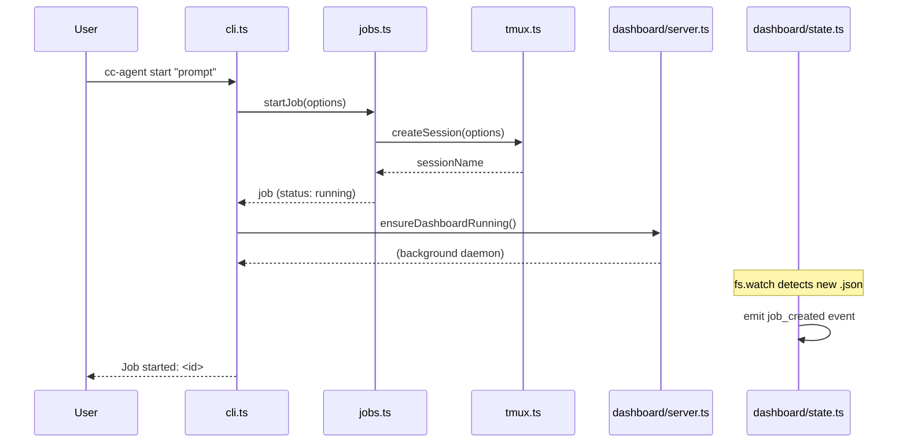
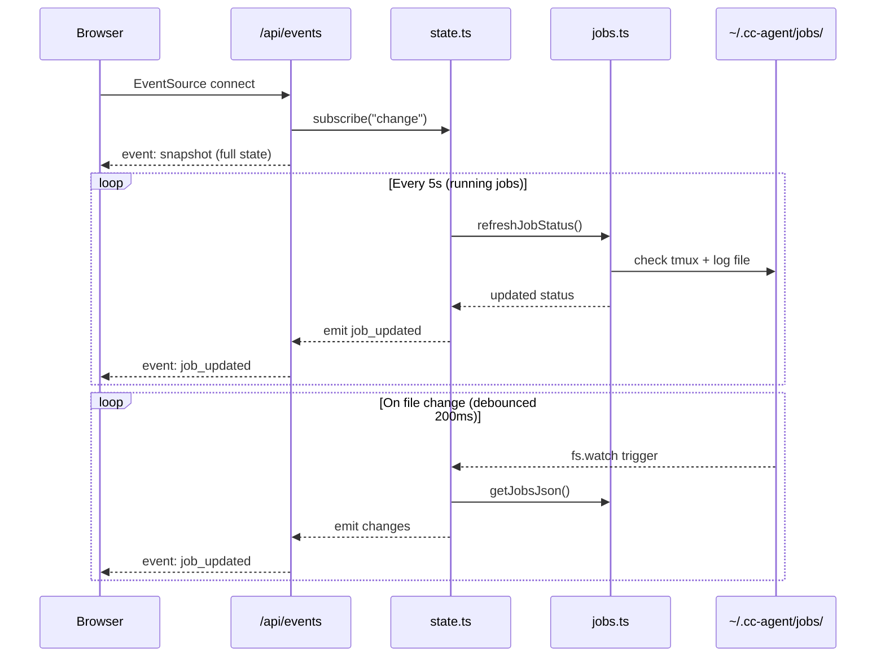
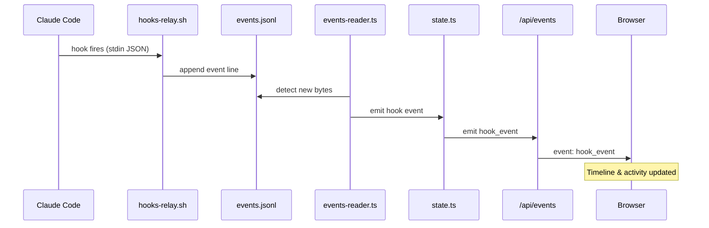
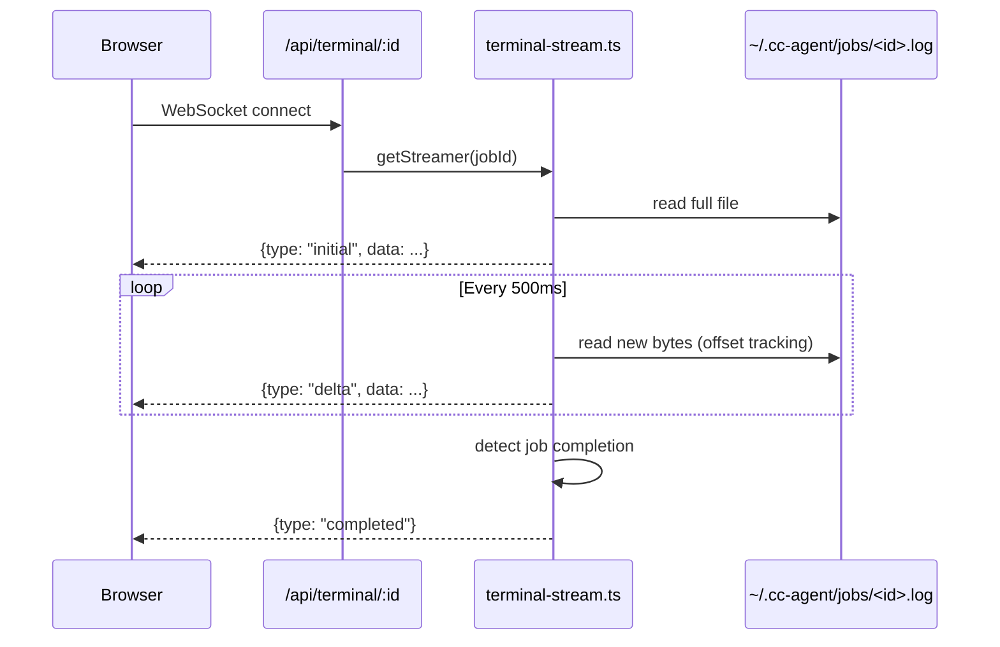

# Codebase Map

> Auto-generated by Cartographer. Last mapped: 2026-02-10

## System Overview

CLI tool for delegating tasks to Claude Code agents via tmux sessions. Includes a real-time web dashboard (Hono + Preact), bidirectional agent communication, terminal streaming, analytics, and a Claude Code plugin marketplace.

```mermaid
graph TB
    subgraph CLI["CLI Layer"]
        BIN[bin/cc-agent]
        CLI_TS[src/cli.ts]
    end

    subgraph Core["Core"]
        JOBS[src/jobs.ts]
        TMUX[src/tmux.ts]
        CONFIG[src/config.ts]
        FILES[src/files.ts]
        PARSER[src/session-parser.ts]
    end

    subgraph Dashboard["Dashboard Server"]
        SERVER[server.ts]
        STATE[state.ts]
        DB[db.ts - SQLite]
        EVENTS[events-reader.ts]
        HOOKS_MGR[hooks-manager.ts]
        TERM_STREAM[terminal-stream.ts]
        subgraph API["API Routes"]
            API_JOBS[/api/jobs]
            API_EVENTS[/api/events SSE]
            API_METRICS[/api/metrics]
            API_ACTIONS[/api/actions]
            API_HOOKS[/api/hook-events]
            API_TERM[/api/terminal WS]
        end
    end

    subgraph UI["Preact UI"]
        APP[app.tsx]
        DASH_VIEW[Dashboard]
        DETAIL[JobDetail]
        TERMINAL[TerminalPanel]
        METRICS_VIEW[MetricsChart]
        TIMELINE[Timeline]
    end

    subgraph External["External"]
        TMUX_BIN[tmux]
        CLAUDE[claude CLI]
        HOOKS_RELAY[hooks-relay.sh]
    end

    subgraph Storage["Storage"]
        JOBS_DIR[~/.cc-agent/jobs/]
        EVENTS_FILE[events.jsonl]
        SQLITE[(dashboard.db)]
        SESSIONS[~/.claude/projects/]
    end

    BIN --> CLI_TS
    CLI_TS --> JOBS
    CLI_TS --> FILES
    CLI_TS --> CONFIG
    CLI_TS --> SERVER
    JOBS --> TMUX
    JOBS --> PARSER
    PARSER --> SESSIONS
    TMUX --> TMUX_BIN
    TMUX --> CLAUDE
    JOBS --> JOBS_DIR

    SERVER --> STATE
    SERVER --> TERM_STREAM
    SERVER --> API_JOBS
    SERVER --> API_EVENTS
    SERVER --> API_METRICS
    SERVER --> API_ACTIONS
    SERVER --> API_HOOKS
    SERVER --> API_TERM

    STATE --> JOBS
    STATE --> EVENTS
    STATE --> DB
    EVENTS --> EVENTS_FILE
    HOOKS_MGR --> HOOKS_RELAY
    HOOKS_RELAY --> EVENTS_FILE
    TERM_STREAM --> JOBS_DIR
    DB --> SQLITE

    APP --> DASH_VIEW
    APP --> DETAIL
    APP --> METRICS_VIEW
    APP --> TIMELINE
    DETAIL --> TERMINAL
    DASH_VIEW -.->|SSE| API_EVENTS
    TERMINAL -.->|WebSocket| API_TERM
    METRICS_VIEW -.->|REST| API_METRICS
```

## Directory Structure

```
cc-master/
├── bin/
│   └── cc-agent                 # Shell wrapper (99 tok)
├── src/
│   ├── cli.ts                   # CLI entry point & commands (5,438 tok)
│   ├── config.ts                # Configuration constants (206 tok)
│   ├── files.ts                 # File loading for context injection (589 tok)
│   ├── jobs.ts                  # Job lifecycle & persistence (2,905 tok)
│   ├── session-parser.ts        # Parse Claude session metadata (1,857 tok)
│   ├── tmux.ts                  # tmux session management (2,427 tok)
│   └── dashboard/
│       ├── server.ts            # Hono server, UI bundling, lifecycle (1,693 tok)
│       ├── state.ts             # In-memory state, fs watching, events (1,467 tok)
│       ├── db.ts                # SQLite persistence (1,523 tok)
│       ├── events-reader.ts     # Tail-follow events.jsonl (799 tok)
│       ├── hooks-manager.ts     # Install/remove Claude hooks (1,056 tok)
│       ├── hooks-relay.sh       # Shell script for hook event relay (411 tok)
│       ├── terminal-stream.ts   # WebSocket terminal streaming (860 tok)
│       └── api/
│           ├── actions.ts       # POST: start/send/kill jobs (639 tok)
│           ├── events.ts        # SSE: real-time updates (396 tok)
│           ├── hook-events.ts   # GET: recent hook events (164 tok)
│           ├── jobs.ts          # GET: job list/detail (215 tok)
│           └── metrics.ts       # GET: current/historical metrics (233 tok)
├── ui/
│   └── src/
│       ├── index.tsx            # Preact mount point (30 tok)
│       ├── app.tsx              # Root component, routing, shortcuts (1,506 tok)
│       ├── components/
│       │   ├── CommandPalette.tsx    # Ctrl+K command launcher (1,117 tok)
│       │   ├── Dashboard.tsx        # Job grid with filter/sort (788 tok)
│       │   ├── JobCard.tsx          # Job card with live timer (839 tok)
│       │   ├── JobDetail.tsx        # Full job view + controls (1,442 tok)
│       │   ├── MessageInput.tsx     # Send message to agent (412 tok)
│       │   ├── MetricsChart.tsx     # Canvas analytics charts (2,269 tok)
│       │   ├── NewJobForm.tsx       # Create new agent modal (1,074 tok)
│       │   ├── NotificationCenter.tsx # Alert inbox (876 tok)
│       │   ├── PipelineView.tsx     # Gantt-style job timeline (771 tok)
│       │   ├── SplitTerminal.tsx    # Multi-terminal grid (804 tok)
│       │   ├── StatusBar.tsx        # Aggregate metrics bar (280 tok)
│       │   ├── TerminalPanel.tsx    # xterm.js terminal (566 tok)
│       │   └── Timeline.tsx         # Hook event timeline (961 tok)
│       ├── hooks/
│       │   ├── useJobs.ts       # SSE state management (1,603 tok)
│       │   └── useTerminal.ts   # WebSocket terminal hook (294 tok)
│       ├── lib/
│       │   ├── api.ts           # API helpers (56 tok)
│       │   └── format.ts        # Display formatters (335 tok)
│       └── styles/
│           ├── theme.css        # CSS variables, dark theme (300 tok)
│           └── layout.css       # All component styles (7,902 tok)
├── plugins/
│   └── cc-orchestrator/
│       ├── .claude-plugin/plugin.json   # Plugin metadata
│       ├── scripts/install.sh           # Installation script (2,119 tok)
│       ├── skills/
│       │   ├── cc-orchestrator/SKILL.md # Orchestration skill (4,954 tok)
│       │   ├── cco-update/SKILL.md      # Update skill (387 tok)
│       │   └── cartographer/
│       │       ├── SKILL.md             # Mapping skill (2,150 tok)
│       │       └── scripts/scan-codebase.py  # Token scanner (3,357 tok)
│       └── LICENSE
├── .claude-plugin/marketplace.json  # Plugin marketplace registry
├── package.json
├── tsconfig.json
└── CLAUDE.md
```

## Module Guide

### Core: `src/cli.ts`

**Purpose**: Main CLI entry point — parses arguments, routes to commands, manages dashboard lifecycle.

**Key Exports**: `main()`, `parseArgs()`, `resolveModel()`, `formatDuration()`, `formatJobStatus()`

**Commands**: `start`, `status`, `send`, `capture`, `output`, `attach`, `watch`, `jobs`, `sessions`, `kill`, `clean`, `delete`, `dashboard`, `dashboard-stop`, `health`, `setup-hooks`, `remove-hooks`

**Key Behaviors**:
- Unknown commands treated as prompts for `start`
- Dashboard auto-starts when agents spawn (`ensureDashboardRunning()`)
- `-r low` maps to sonnet model, all other reasoning levels to opus (unless `-m` overrides)
- Jobs sorted by status rank (running > pending > failed > completed), then date

---

### Core: `src/jobs.ts`

**Purpose**: Job lifecycle, persistence (JSON files in `~/.cc-agent/jobs/`), and status tracking.

**Key Exports**: `startJob()`, `loadJob()`, `saveJob()`, `listJobs()`, `deleteJob()`, `killJob()`, `sendToJob()`, `getJobOutput()`, `refreshJobStatus()`, `cleanupOldJobs()`, `getJobsJson()`

**Key Behaviors**:
- Dual persistence: `.json` (metadata) + `.prompt` (prompt text) + `.log` (terminal output)
- Completion detected via marker string `[cc-agent: Session complete`
- Inactivity timeout: 60min based on log file mtime
- `getJobsJson()` enriches data with tokens/files/summary from parsed session files
- Corrupted JSON files silently skipped in `listJobs()`

---

### Core: `src/tmux.ts`

**Purpose**: Low-level tmux session management — create, message, capture, kill.

**Key Exports**: `createSession()`, `sendMessage()`, `capturePane()`, `captureFullHistory()`, `killSession()`, `listSessions()`, `resolveClaudePath()`

**Key Behaviors**:
- Uses `script -q` to log terminal output to file
- Prompts <5000 chars sent via `send-keys`; longer via `load-buffer` + `paste-buffer`
- 0.3s delay between typing and Enter for TUI processing
- Single quotes escaped as `'\''` for shell safety
- Path resolution: checks `~/.claude/local/claude` before `which claude`
- `read-only` sandbox maps to `--allowedTools` restriction

---

### Core: `src/session-parser.ts`

**Purpose**: Parses Claude `.jsonl`/`.json` session files for token counts, modified files, summaries.

**Key Exports**: `extractSessionId()`, `findSessionFile()`, `parseSessionFile()`

**Key Behaviors**:
- ANSI stripping before pattern matching
- Recursive BFS search in `~/.claude/projects/` for session files
- Token counts from `token_count` events in JSONL stream
- File modifications extracted from `apply_patch` tool calls
- Returns null on any parsing error (silent failure)

---

### Core: `src/config.ts`

**Purpose**: Central configuration constants.

**Key Values**: `model: "opus"`, `jobsDir: ~/.cc-agent/jobs`, `tmuxPrefix: "cc-agent"`, `defaultTimeout: 60min`, `defaultSandbox: "workspace-write"`, `defaultReasoningEffort: "xhigh"`

---

### Core: `src/files.ts`

**Purpose**: File loading for context injection into prompts.

**Key Exports**: `loadFiles()`, `estimateTokens()`, `formatPromptWithFiles()`, `loadCodebaseMap()`

**Filters**: Skip binary (null bytes), skip >500KB, deduplicate, support `!` negation patterns.

---

### Dashboard: `src/dashboard/server.ts`

**Purpose**: Hono HTTP server + WebSocket upgrade for terminal streaming. Bundles UI on startup via `Bun.build()`.

**Key Exports**: `startDashboard()`, `stopDashboard()`, `ensureDashboardRunning()`, `createDashboardApp()`

**Key Behaviors**:
- Port default: 3131, pidfile: `~/.cc-agent/dashboard.pid`
- Background daemon via detached child process
- SPA routing: all non-API routes return `index.html`
- WebSocket upgrade at Bun.serve level (not Hono middleware)
- UI built inline on startup — fails if build fails

---

### Dashboard: `src/dashboard/state.ts`

**Purpose**: In-memory state manager with `fs.watch` + 5s polling. Emits events to SSE clients.

**Key Exports**: `DashboardState` (EventEmitter), `getDashboardState()` singleton

**Key Behaviors**:
- Watches `~/.cc-agent/jobs/` directory (200ms debounce)
- 5s polling for running jobs (catches tmux session completion)
- Change detection via JSON stringification comparison
- Records to SQLite on job completion/failure
- Re-emits hook events from `EventsReader`

---

### Dashboard: `src/dashboard/db.ts`

**Purpose**: SQLite persistence for historical jobs, hook events, daily metrics.

**Key Exports**: `getDb()`, `recordJobCompletion()`, `recordHookEvent()`, `getMetricsHistory()`, `getJobHistory()`

**Key Behaviors**:
- Database: `~/.cc-agent/dashboard.db` (WAL mode)
- Tables: `job_history`, `hook_events`, `daily_metrics`
- Upsert pattern with `INSERT OR REPLACE`
- No automatic cleanup (grows unbounded)

---

### Dashboard: `src/dashboard/events-reader.ts`

**Purpose**: Tail-follows `~/.cc-agent/events.jsonl`, emits parsed hook events.

**Key Behaviors**: Byte-offset tracking, starts at EOF, 2s polling fallback, 100ms debounce on fs.watch.

---

### Dashboard: `src/dashboard/hooks-manager.ts`

**Purpose**: Installs/removes Claude Code hooks in `~/.claude/settings.json`.

**Hooks Registered**: `PreToolUse`, `PostToolUse` (Write|Edit|Bash), `PostToolUseFailure`, `Stop`, `Notification`, `SessionStart`, `SessionEnd`, `PreCompact`

---

### Dashboard: `src/dashboard/hooks-relay.sh`

**Purpose**: Shell script executed by Claude hooks. Appends JSON events to `events.jsonl`.

**Requires**: `jq` installed. Extracts job ID from tmux session name.

---

### Dashboard: `src/dashboard/terminal-stream.ts`

**Purpose**: WebSocket streaming of job log files with byte-offset tracking.

**Messages**: `initial` (full log), `delta` (new bytes), `completed` (job done). 500ms poll interval.

---

### Dashboard API Routes

| Endpoint | Method | Purpose |
|----------|--------|---------|
| `/api/jobs` | GET | List all jobs (enriched) |
| `/api/jobs/:id` | GET | Single job detail (refreshes status) |
| `/api/events` | GET | SSE stream (snapshot + push updates, 30s heartbeat) |
| `/api/metrics` | GET | Current aggregate metrics |
| `/api/metrics/history?range=7d` | GET | Daily time-series (7d/30d/90d) |
| `/api/metrics/jobs?limit=50` | GET | Historical job records |
| `/api/actions/jobs` | POST | Start new agent |
| `/api/actions/jobs/:id/send` | POST | Send message to running agent |
| `/api/actions/jobs/:id/kill` | POST | Kill agent |
| `/api/hook-events?limit=50` | GET | Recent hook events |
| `/api/terminal/:jobId` | WS | Terminal output streaming |

---

### UI: `ui/src/app.tsx`

**Purpose**: Root Preact component — hash-based routing, global keyboard shortcuts, modal management.

**Routes**: `#/` (Dashboard), `#/jobs/:id` (JobDetail), `#/timeline`, `#/notifications`, `#/analytics`, `#/split`, `#/pipeline`

**Shortcuts**: `N` = new agent, `/` = focus search, `?` = help, `Ctrl+K` = command palette, `Esc` = close modals

---

### UI: `ui/src/hooks/useJobs.ts`

**Purpose**: Central state hook. Connects to `/api/events` SSE. Manages jobs, metrics, hook events, notifications.

**Key Behaviors**:
- SSE reconnects automatically
- Notifications generated client-side from job status transitions
- Limits: 200 hook events, 100 notifications max
- Initial snapshot doesn't generate notifications

---

### UI: `ui/src/hooks/useTerminal.ts`

**Purpose**: WebSocket hook for `/api/terminal/:jobId`. Feeds data to xterm.js via writer ref pattern.

---

### UI Component Hierarchy

```
App
├── Topbar (nav links, Ctrl+K button, New Agent button, connection dot)
├── Content (hash-routed)
│   ├── Dashboard → StatusBar + JobCard[]
│   ├── JobDetail → TerminalPanel + MessageInput + Timeline (filtered)
│   ├── Timeline
│   ├── NotificationCenter
│   ├── MetricsChart (canvas-rendered, no charting lib)
│   ├── SplitTerminal → TerminalPanel[] (1x1, 2x1, 2x2 layouts)
│   └── PipelineView (Gantt-style bars)
└── Modals: NewJobForm, CommandPalette, Help
```

---

### Plugin Marketplace

```
.claude-plugin/marketplace.json     # Registry
plugins/cc-orchestrator/
  .claude-plugin/plugin.json        # Plugin metadata
  skills/
    cc-orchestrator/SKILL.md        # Main orchestration skill
    cco-update/SKILL.md             # Update skill (git reset --hard)
    cartographer/SKILL.md           # Codebase mapping skill
    cartographer/scripts/scan-codebase.py  # Token counter (tiktoken)
  scripts/install.sh                # Platform-aware installer
```

## Data Flow

### Job Creation



### Real-time Dashboard Updates



### Hook Event Pipeline



### Terminal Streaming



## Storage Structure

```
~/.cc-agent/
├── jobs/
│   ├── <jobId>.json          # Job metadata (status, model, timestamps)
│   ├── <jobId>.prompt        # Original prompt text
│   └── <jobId>.log           # Terminal output (via script command)
├── dashboard.pid             # Dashboard process ID
├── dashboard.db              # SQLite (job history, metrics, hook events)
├── events.jsonl              # Hook event stream (appended by relay)
└── hooks/
    └── relay-event.sh        # Installed hook relay script
```

## Conventions

- **Runtime**: Bun only (never npm/yarn/pnpm)
- **Session naming**: `cc-agent-<8-char-hex-id>`
- **Job IDs**: 8 random hex characters (4 bytes)
- **Output capture**: tmux pane first, log file fallback
- **Completion detection**: marker string `[cc-agent: Session complete`
- **UI framework**: Preact (not React)
- **Routing**: Hash-based (`#/path`), no router library
- **State management**: Props drilling from `useJobs()` hook, no global store
- **Styling**: Vanilla CSS with custom properties, BEM-inspired naming, dark theme only
- **Communication**: SSE for job updates, WebSocket for terminal streams, REST for actions
- **Charts**: Manual canvas rendering (no charting library)

## Gotchas

1. **Dashboard auto-starts** silently when first agent spawns
2. **Fixed delays**: 0.3s sleep in tmux for TUI processing
3. **Shell escaping**: Single quotes escaped as `'\''` in tmux commands
4. **Platform**: Unix-like only (tmux, `script` command)
5. **Log files**: Contain ANSI terminal codes (use `--strip-ansi` for clean output)
6. **50MB buffer limit** on `captureFullHistory()`
7. **Permissions**: Uses `--dangerously-skip-permissions` for unattended agents
8. **Hooks require `jq`**: relay script fails silently without it
9. **Completion delay**: Up to 5s lag for dashboard job completion detection
10. **SQLite + events.jsonl grow unbounded** (no automatic cleanup)
11. **UI build on startup**: Dashboard won't start if Preact build fails
12. **Token estimation**: Very rough (4 chars/token), not production-accurate
13. **Session file search**: Recursive BFS in `~/.claude/projects/` (could be slow on large dirs)
14. **WebSocket no auto-reconnect**: Terminal panels create new connection on jobId change

## Navigation Guide

**To add a new CLI command**: Add case in `src/cli.ts` switch + add help text to HELP constant

**To add a new API endpoint**: Create route in `src/dashboard/api/`, register in `src/dashboard/server.ts`

**To add a new UI page**: Create component in `ui/src/components/`, add route case in `ui/src/app.tsx`, add nav link

**To add a new dashboard view**: Follow above + add CSS in `ui/src/styles/layout.css`

**To modify job storage**: Edit `src/jobs.ts` (save/load functions)

**To change tmux behavior**: Edit `src/tmux.ts` (createSession for startup, sendMessage for input)

**To add a new hook event type**: Edit `src/dashboard/hooks-manager.ts` (HOOK_TYPES), update relay script

**To add a new plugin skill**: Create `plugins/cc-orchestrator/skills/<name>/SKILL.md`

**To change default config**: Edit `src/config.ts`

**To change theme/colors**: Edit `ui/src/styles/theme.css`
